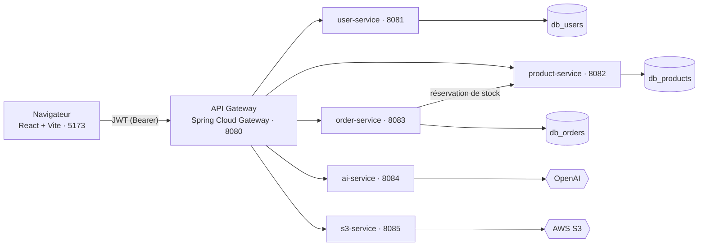

# 🛒 E-commerce en microservices

[](https://github.com/MohammedELouaqqad/Ecommerce/actions/workflows/CI.yml)

Plateforme e-commerce complète : **5 services métier Spring Boot** derrière une **passerelle API**, une interface **React**, un **assistant IA** et le stockage des images sur **AWS S3**.

Le projet est né d'un monolithe Spring Boot, découpé ensuite en microservices, chacun avec sa propre base de données. Une part importante du travail a porté sur la **sécurité** et la **cohérence des données** — c'est détaillé plus bas.

<!-- Ajoutez vos captures dans docs/screenshots/ puis décommentez :
| Boutique | Assistant IA |
|---|---|
|  |  |
-->

---

## Architecture



Le navigateur ne parle **qu'à la passerelle**. C'est elle qui vérifie le jeton, applique les règles d'accès, gère le CORS et transmet l'identité de l'appelant aux services.

Seule la passerelle publie un port sur la machine hôte (**8080**). Les ports listés ci-dessous sont **internes au réseau Docker** : les services ne sont pas joignables directement, ce qui garantit que personne ne peut contourner la vérification du jeton et des rôles.

| Service | Port | Rôle | Base |
|---|---|---|---|
| **api-gateway** | 8080 | Routage, vérification du JWT, autorisations, CORS | — |
| **user-service** | 8081 | Inscription, connexion, comptes et rôles | `db_users` |
| **product-service** | 8082 | Catalogue et stock | `db_products` |
| **order-service** | 8083 | Commandes, appelle product-service pour le stock | `db_orders` |
| **ai-service** | 8084 | Assistant conversationnel (OpenAI) | — |
| **s3-service** | 8085 | Envoi et lecture des images produits | — |

---

## Stack technique

| Domaine | Technologies |
|---|---|
| **Backend** | Java 17, Spring Boot 3.5.11, Spring Cloud Gateway 2025.0.3 (WebFlux), Spring Security, Spring Data JPA |
| **Authentification** | JWT (jjwt 0.12.6), BCrypt |
| **Données** | MySQL 8.0, une base par service |
| **IA** | Spring AI 1.1.2 (OpenAI) |
| **Stockage** | AWS SDK v2 (S3) |
| **Frontend** | React 19, Vite 7, Tailwind CSS 4, Axios, React Router 7 |
| **Infrastructure** | Docker, Docker Compose, images multi-étapes |

---

## Démarrage rapide

**Prérequis :** Docker Desktop, et Node.js 20+ pour l'interface.

**1. Configuration**

```bash
cp .env.example .env
openssl rand -base64 32          # à coller dans JWT_SECRET
```

Remplissez ensuite `ADMIN_EMAIL` et `ADMIN_PASSWORD` : ce compte administrateur est créé au premier démarrage, uniquement si la base n'en contient aucun.

**2. Backend**

```bash
docker compose up -d --build
docker compose logs -f api-gateway | grep -m1 "Started BackendApplication"
```

La seconde commande rend la main dès que la passerelle est prête. Comptez une à deux minutes au premier lancement.

Pour ouvrir les ports des services le temps d'un débogage — en local uniquement :

```bash
docker compose -f docker-compose.yml -f docker-compose.debug.yml up -d
```

**3. Interface**

```bash
cd frontend
npm install
npm run dev        # http://localhost:5173
```

Connectez-vous avec le compte administrateur, ajoutez des produits, puis créez un compte client pour parcourir la boutique.

---

## API

Toutes les routes passent par la passerelle, sur `http://localhost:8080`.

| Méthode | Route | Accès | Service |
|---|---|---|---|
| POST | `/api/auth/register` | public | user |
| POST | `/api/auth/authenticate` | public | user |
| GET | `/api/auth/admin/allUsers` | Admin | user |
| POST | `/api/auth/admin/register` | Admin | user |
| DELETE | `/api/auth/admin/deleteUser/{id}` | Admin | user |
| GET | `/api/customer/allProducts` | connecté | product |
| GET | `/api/customer/product/{id}` | connecté | product |
| POST | `/api/admin/addProduct` | Admin | product |
| PUT | `/api/admin/editProduct/{id}` | Admin | product |
| DELETE | `/api/admin/deleteProduct/{id}` | Admin | product |
| GET | `/api/customer/allOrders` | connecté | order |
| POST | `/api/customer/addOrder` | connecté | order |
| PUT | `/api/admin/editOrder/{id}` | Admin | order |
| POST | `/api/customer/chat` | connecté | ai |
| POST | `/api/customer/upload` | connecté | s3 |
| GET | `/api/customer/download/{fichier}` | public | s3 |

Les routes `/api/internal/**` de product-service (réservation et libération de stock) ne sont **pas** routées par la passerelle : elles ne servent qu'aux appels entre services.

---

## Sécurité et cohérence des données

Le principe suivi partout : **le serveur ne fait jamais confiance au client** pour une décision qui le concerne.

| Risque | Traitement retenu |
|---|---|
| **Élévation de privilège** — le rôle était choisi dans le formulaire d'inscription | L'inscription publique force le rôle `Customer`, et le champ a disparu du DTO. La création de comptes privilégiés passe par une route réservée aux administrateurs. |
| **Secret JWT en dur dans le code** | Lu depuis une variable d'environnement. Les services **refusent de démarrer** si la clé est absente, mal encodée ou inférieure à 256 bits. |
| **Usurpation d'identité** — le client envoyait son propre identifiant | La passerelle extrait l'identité du jeton vérifié et la transmet dans des en-têtes `X-User-*`. Tout en-tête de ce nom envoyé par le client est **supprimé** avant traitement. |
| **Fuite entre clients** — la liste des commandes renvoyait tout à tout le monde | Filtrage **en base** : un client ne reçoit que ses commandes, un administrateur les reçoit toutes. |
| **Survente de stock** en cas d'achats simultanés | Vérification et décrémentation dans **un seul `UPDATE` conditionnel**, donc atomiques. Réservation d'une commande en tout-ou-rien, avec compensation si l'enregistrement échoue. |
| **Écrasement de commande** — un `id` envoyé dans le corps provoquait une mise à jour | Identifiant, propriétaire et statut sont imposés par le serveur. |
| **Hash de mot de passe exposé** dans les réponses | L'API ne sérialise plus les entités : un DTO n'expose que l'identifiant, le nom, l'email et le rôle. |
| **CORS dispersé** dans chaque service | Centralisé sur la passerelle, avec une liste d'origines déclarées. Les services n'en déclarent plus. |

Chaque correctif a été validé par un scénario reproduisant l'attaque : 20 commandes simultanées sur le dernier exemplaire, jetons forgés avec l'ancien secret, en-têtes d'identité falsifiés, inscription en administrateur.

---

## Tests

```bash
# Un service
mvn -f product-service/pom.xml test

# Tous les services testés
for s in api-gateway user-service product-service order-service; do mvn -f $s/pom.xml test; done
```

Les tests visent les points où une erreur coûte cher et passe inaperçue, pas le CRUD :

| Service | Ce qui est vérifié |
|---|---|
| **product-service** | 20 clients simultanés sur le dernier exemplaire : un seul est servi ; une commande dont un article manque n'entame aucun stock ; une quantité négative est refusée |
| **order-service** | le corps de la requête ne choisit ni le propriétaire, ni le prix, ni le statut, ni l'identifiant de la commande ; le stock réservé est rendu si l'enregistrement échoue ; aucune commande n'est créée quand le stock manque |
| **user-service** | l'inscription publique crée toujours un `Customer` ; les routes d'administration sont fermées aux anonymes et aux clients ; aucune réponse ne contient de mot de passe ; les rôles acceptés sont limités |
| **api-gateway** | les en-têtes d'identité envoyés par un client sont remplacés par ceux du jeton ; une requête anonyme n'en transmet aucun ; un jeton signé avec une autre clé est rejeté ; une clé absente ou faible empêche le démarrage |

Les tests d'intégration utilisent une base **H2 en mémoire** : aucune installation ni conteneur n'est nécessaire pour les lancer.

Chaque test a été validé en réintroduisant la faille qu'il surveille : sans le correctif, le test échoue. Par exemple, avec l'ancienne lecture-puis-écriture du stock, **10 clients sur 20 obtiennent le dernier exemplaire**.

---

## Configuration

Toutes les valeurs sensibles vivent dans `.env`, ignoré par Git. Le modèle `.env.example` liste les variables attendues.

| Variable | Rôle |
|---|---|
| `JWT_SECRET` | Clé de signature des jetons, partagée par la passerelle et user-service. Base64, 256 bits minimum. |
| `ADMIN_EMAIL`, `ADMIN_PASSWORD` | Compte administrateur créé au démarrage si aucun n'existe. |
| `SPRING_DATASOURCE_USERNAME`, `SPRING_DATASOURCE_PASSWORD` | Accès MySQL des services. |
| `CORS_ALLOWED_ORIGINS` | Origines autorisées à appeler l'API depuis un navigateur. |
| `OPENAI_ENABLED`, `SPRING_AI_MODEL_CHAT`, `OPEN_AI_KEY` | Assistant IA. Les deux premiers doivent valoir `true` et `openai` pour l'activer. |
| `AWS_S3_ENABLED`, `AWS_ACCESS_KEY`, `AWS_SECRET_KEY`, `AWS_REGION`, `AWS_BUCKET_NAME` | Stockage des images. |

L'IA et S3 sont **désactivés par défaut** : le projet démarre sans aucune clé externe, les routes correspondantes renvoient simplement 404.

---

## Dépannage

| Symptôme | Cause et solution |
|---|---|
| `net::ERR_EMPTY_RESPONSE` | Le service n'a pas fini de démarrer. Attendez le message `Started BackendApplication`. |
| `401` sur la connexion ou l'inscription | Un jeton périmé traîne dans le navigateur. Videz-le : `localStorage.clear()` dans la console. |
| `500` sur les images produits | L'utilisateur IAM n'a pas les droits `s3:PutObject` et `s3:GetObject` sur le bucket. |
| `500` après avoir recréé un conteneur | La passerelle a gardé l'ancienne adresse IP du service. `docker compose restart api-gateway`. |
| `docker compose` refuse de démarrer | `JWT_SECRET` est absent de `.env`. C'est volontaire. |

---

## Structure du dépôt

```
api-gateway/      Routage, sécurité, CORS
user-service/     Comptes, rôles, JWT
product-service/  Catalogue et stock
order-service/    Commandes
ai-service/       Assistant IA
s3-service/       Images
frontend/         Interface React
docker-compose.yml
.env.example
```

---

## Prochaines étapes

- Étendre la couverture : parcours frontend et tests de contrat entre services
- Intégration continue : lancer ces tests à chaque push
- Découverte de services et configuration centralisée, à la place des adresses codées en dur
- Résilience : coupe-circuit et délais d'attente sur les appels entre services
- Observabilité : traçage distribué et sonde de santé sur chaque service
- Messagerie asynchrone entre commandes et catalogue, avec un journal des messages sortants pour fiabiliser la compensation
- En production : ne publier que le port de la passerelle et donner à chaque service son propre compte MySQL
